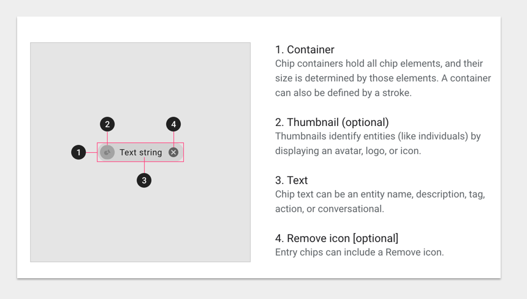
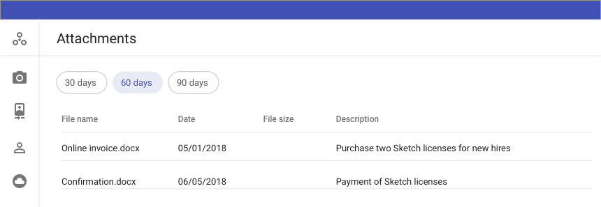
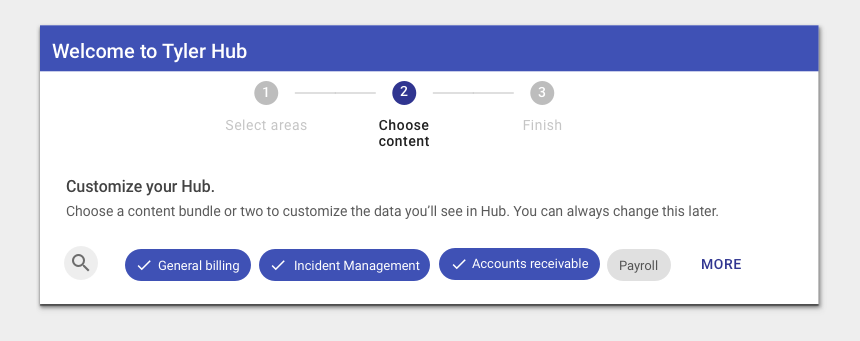
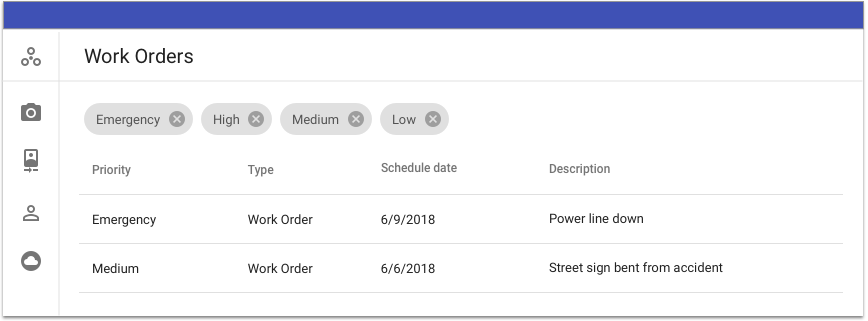

# Chips
Chips are compact elements that represent an input, attribute, or action

# Anatomy
  

# Usage
    
<ul>
<li>May contain a photo/icon, short title, rules, brief information or a contact</li>
<li>Allow users to make selections, filter content, or trigger actions.  </li>
<li>May be deleted if they display a delete icon</li>
</ul>

# Types
<ul>
<li>Choice chips</li>
<li>Filter chips</li>
<li>Informational chips</li>
</ul>

# Specs
<ul>
<li>Height:  32px</li>
<li>Label:  13px Roboto Regular, 87% black</li>
<li>Unselected background color:  E0E0E0 or Transparent</li>
<li>Unselected text color:  60% black</li>
<li>Active background color:  12% primary(3F51B5)</li>
<li>Active text color:  Primary(#3F51B5)</li>
</ul>

# Option 2
<ul>
<li>Active background color:  Primary</li>
<li>Active text color:  #fff(white) </li>
</ul>

# Choice chips

 
 

<ul>
<li>Display in sets that contain at least two options.  Choice chips represent a single selection.</li>
<li>They are a good alternative to toggle buttons, radio buttons, and single select menus.</li>
</ul>

# Filter chips

Chips are used to filter data.  Multiple chips can be selected or deselected.  Display an icon when the chip is selected.
If chips are used to represent filter criteria, then display a delete icon so the chip can be deleted.

